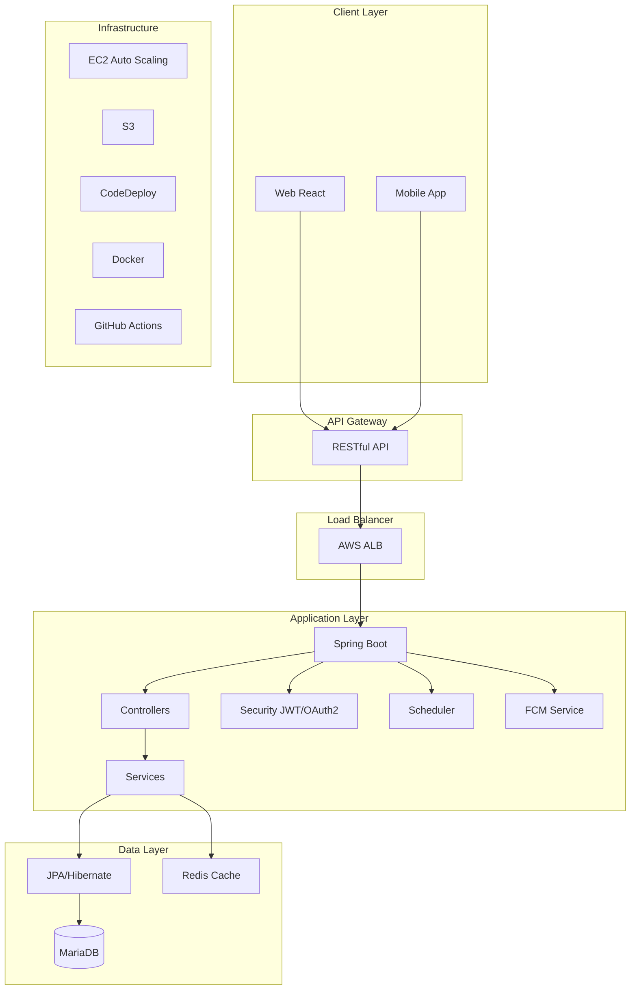
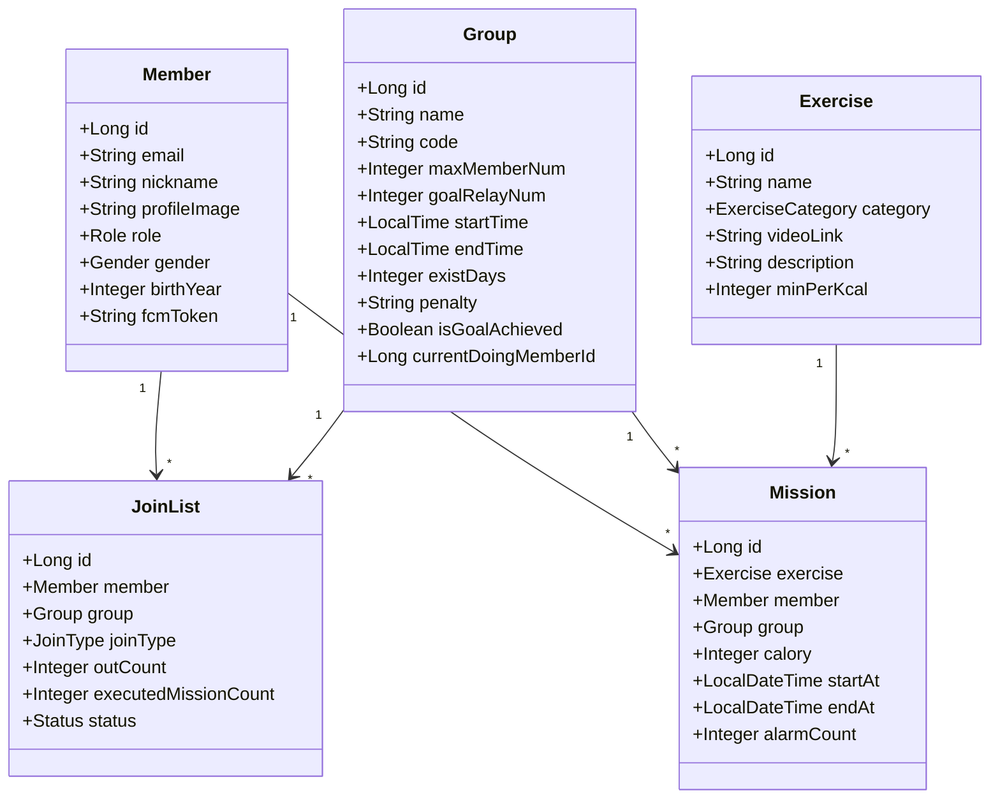

# 🏃‍♂️ Snack Exercise - 간식처럼 가벼운 운동 릴레이 서비스

> 일상 속 짧은 시간을 활용하여 함께하는 운동 릴레이 플랫폼

## 📌 프로젝트 소개

Snack Exercise는 친구들과 함께 짧은 운동을 릴레이 형식으로 수행하며 건강한 습관을 만들어가는 서비스입니다.  
간식을 먹듯 가볍게, 하지만 꾸준히 운동할 수 있도록 돕습니다.

### 주요 특징
- 👥 **그룹 운동 릴레이**: 친구들과 함께 운동 목표를 달성
- ⏰ **자동 미션 할당**: 설정된 시간에 자동으로 운동 미션 배정
- 📊 **실시간 랭킹**: 미션 수행 속도 기반 개인/그룹 랭킹
- 🔔 **스마트 알림**: FCM 기반 독촉 알림 및 미션 알림
- 🎯 **목표 달성 시스템**: 그룹별 릴레이 목표 설정 및 달성

## 🏗 시스템 아키텍처



## 🛠 기술 스택

### Backend
- **Framework**: Spring Boot 3.1.1  
- **Language**: Java 17  
- **Build Tool**: Gradle  
- **ORM**: Spring Data JPA / Hibernate  
- **Security**: Spring Security + JWT + OAuth2 (Kakao)  
- **Database**: MariaDB (Production), H2 (Development)  
- **Cache**: Redis  
- **Push Notification**: Firebase Cloud Messaging (FCM)  

### Infrastructure
- **Container**: Docker & Docker Compose  
- **CI/CD**: GitHub Actions  
- **Cloud**: AWS (EC2, S3, CodeDeploy, ALB)  
- **Monitoring**: Spring Actuator  

### Documentation
- **API Docs**: Swagger/OpenAPI 3.0  

## 📊 주요 도메인 모델


## 🔥 핵심 기능

### 1. 그룹 관리
- **그룹 생성**: 운동 시간, 목표 릴레이 횟수, 벌칙 등 설정  
- **그룹 참여**: 6자리 코드로 간편하게 그룹 참여  
- **그룹 관리**: 방장 권한으로 멤버 관리 및 그룹 설정 변경  

### 2. 미션 시스템
- **자동 할당**: 설정된 시간에 자동으로 미션 할당  
- **릴레이 방식**: 한 명이 완료하면 다음 사람에게 자동 전달  
- **랜덤 운동**: 다양한 운동 영상 중 랜덤 선택  

### 3. 알림 시스템
- **미션 알림**: 미션 할당 시 FCM 푸시 알림  
- **독촉 알림**: 설정 시간 경과 시 자동/수동 독촉 알림  
- **목표 달성 알림**: 그룹 목표 달성 시 전체 알림  

### 4. 랭킹 시스템
- **개인 랭킹**: 미션 수행 속도 기반 순위  
- **일간/누적 랭킹**: 당일 및 전체 기간 랭킹 제공  

## 📱 API 엔드포인트

### 인증 (Auth)
- `POST /mvp/auth/sign-up` - MVP 회원가입  
- `POST /mvp/auth/login` - MVP 로그인  
- `POST /api/auth/reissue` - 토큰 재발급  
- `POST /api/auth/logout` - 로그아웃  

### 그룹 (Group)
- `POST /groups` - 그룹 생성  
- `GET /groups/{groupId}` - 그룹 조회  
- `PATCH /groups/{groupId}` - 그룹 수정  
- `POST /groups/join/code` - 코드로 그룹 참여  
- `PATCH /groups/{groupId}/initiation` - 그룹 시작  

### 미션 (Mission)
- `GET /groups/{groupId}/missions` - 당일 미션 현황  
- `GET /groups/{groupId}/missions/rank` - 미션 랭킹  
- `POST /missions/start` - 미션 시작  
- `POST /missions/{missionId}/finish` - 미션 완료  

### 알림 (Notification)
- `PATCH /members/notification` - FCM 토큰 등록  
- `PATCH /alarm/reminder` - 수동 독촉 알림  

## 🚀 배포 프로세스

### Development (develop branch)
1. GitHub Actions 트리거  
2. 애플리케이션 빌드 및 테스트  
3. Docker 이미지 빌드 및 푸시  
4. EC2 인스턴스에 자동 배포  

### Production (main branch)
1. GitHub Actions 트리거  
2. 애플리케이션 빌드 및 테스트  
3. Docker 이미지 빌드 및 푸시  
4. AWS CodeDeploy를 통한 무중단 배포  
5. Auto Scaling Group 적용  

## 👨‍💻 개발 환경

### 필수 요구사항
- Java 17  
- Docker & Docker Compose  
- Redis  
- MariaDB (or H2 for local)  

### 환경 설정 파일
- `application-dev.yml` - 개발 환경 설정  
- `application-prod.yml` - 운영 환경 설정  
- `application-jwt.yml` - JWT 설정  
- `application-oauth.yml` - OAuth2 설정  
- `application-fcm.yml` - FCM 설정  

## 📚 프로젝트 구조

```

snack-exercise-server/
├── .github/                    # GitHub Actions 워크플로우
├── src/
│   ├── main/
│   │   ├── java/com/soma/snackexercise/
│   │   │   ├── auth/          # 인증/인가 관련
│   │   │   ├── config/        # 설정 클래스
│   │   │   ├── controller/    # REST 컨트롤러
│   │   │   ├── domain/        # 엔티티
│   │   │   ├── dto/           # DTO
│   │   │   ├── exception/     # 예외 클래스
│   │   │   ├── repository/    # JPA 레포지토리
│   │   │   ├── service/       # 비즈니스 로직
│   │   │   └── util/          # 유틸리티
│   │   └── resources/
│   │       ├── application.yml
│   │       └── data.sql       # 초기 데이터
│   └── test/                  # 테스트 코드
├── scripts/                   # 배포 스크립트
├── docker-compose.yml         # Docker 설정
├── Dockerfile                 # Docker 이미지 설정
└── build.gradle               # Gradle 빌드 설정

```

## 🔐 보안 및 인증

### JWT 토큰 관리
- **Access Token**: 요청 인증용 (짧은 유효기간)  
- **Refresh Token**: 토큰 재발급용 (Redis 저장)  
- **Token Blacklist**: 로그아웃 토큰 관리  

### OAuth2 소셜 로그인
- Kakao 로그인 지원  
- 신규 회원 자동 가입 프로세스  

## 📈 모니터링 및 로깅

- **Health Check**: `/health` 엔드포인트  
- **Swagger UI**: API 문서 자동 생성  
- **Application Logs**: 스케줄러 및 미션 할당 로그  
- **Error Tracking**: 예외 처리 및 에러 응답 표준화  

## 🎯 주요 비즈니스 로직

### 미션 할당 알고리즘
1. 그룹 내 미션 수행 횟수가 가장 적은 멤버 선택  
2. 동일한 횟수인 경우 랜덤 선택  
3. 운동 종류는 전체 풀에서 랜덤 선택  

### 자동 독촉 시스템
- 설정된 간격(`checkIntervalTime`)마다 체크  
- 최대 독촉 횟수(`checkMaxNum`) 제한  
- 미수행자와 그룹원에게 각각 다른 메시지 전송  

### 그룹 종료 처리
- 설정된 기간(`existDays`) 경과 시 자동 종료  
- 목표 달성 여부 판단 및 알림  
- 모든 `JoinList` 비활성화  

## 🤝 기여 가이드

### 브랜치 전략
- `main`: 프로덕션 배포 브랜치  
- `develop`: 개발 통합 브랜치  
- `feature/*`: 기능 개발 브랜치  
- `hotfix/*`: 긴급 수정 브랜치  

### 커밋 컨벤션
- `feat`: 새로운 기능 추가  
- `fix`: 버그 수정  
- `docs`: 문서 수정  
- `style`: 코드 포맷팅  
- `refactor`: 코드 리팩토링  
- `test`: 테스트 코드  
- `chore`: 빌드 업무 수정  

### Issue Template
- Bug Report  
- Feature Request  
- Discussion  
- Refactor  

## 📊 성능 최적화

- **JPA N+1 문제 해결**: Fetch Join 사용  
- **캐싱 전략**: Redis를 활용한 토큰 캐싱  
- **비동기 처리**: `@Async`를 활용한 알림 전송  
- **DB 인덱싱**: 자주 조회되는 컬럼 인덱스 설정  

---

**함께 운동하며 건강한 습관을 만들어가요! 💪**
